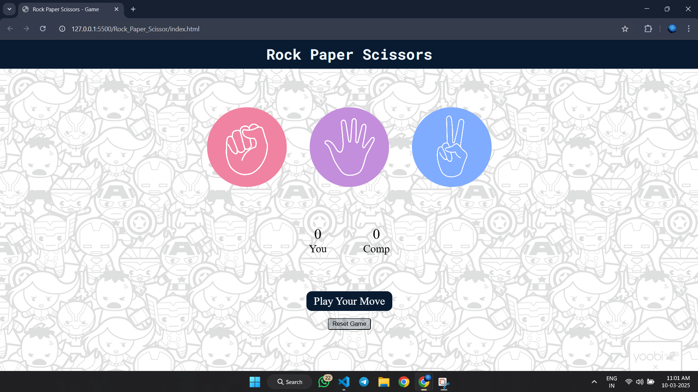

# ✊🖐✌ Rock Paper Scissors Game

## 🎮 Description
This is a fun and interactive **Rock Paper Scissors** game built using **HTML, CSS, and JavaScript**. Play against the computer and see if you can win! 🏆

## ✨ Features
- 🎭 Choose between **Rock, Paper, or Scissors**.
- 🤖 Computer opponent selects a random move.
- 🏅 Displays game results (Win 🥳, Lose 😢, or Draw 🤝).
- 📊 Keeps track of **player vs computer scores**.
- 📱 Responsive design for all devices.
- 🔊 sound effects for a better experience.

## 🛠 Technologies Used
- **📝 HTML** – Structure of the game.
- **🎨 CSS** – Styling and layout.
- **⚡ JavaScript** – Game logic and interactivity.

## 🎯 How to Play
1. Open the `index.html` file in a web browser. 🌐
2. Click on **Rock ✊, Paper 🖐, or Scissors ✌** to make your move.
3. The computer will randomly choose a move. 🤖
4. The result will be displayed with updated scores. 🏅

## 📁 File Structure
```
rock-paper-scissors/
|── images           # Images of Rock Paper Scissor
│── index.html       # 🎭 Game UI
│── style.css        # 🎨 Styling
│── script.js        # ⚡ Game logic
```

## 📸 Screenshots
Here's a preview of the game:



## 🚀 Future Enhancements
- 🎞 Improve UI with animations.
- 👥 Implement a multiplayer mode.
